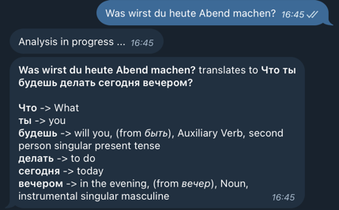

# grammr

Note: This is a clean rewrite of [lingolift](https://github.com/twaslowski/lingolift-core).

Learning languages is hard. This projects aim is to help.

## About

`grammr` is an open-source project with the aim of making learning languages easier.
It allows you to translate sentences between languages, either explaining what a sentence
means in the language you're learning, or providing a translation for an unknown sentence.

Currently, I'm focusing on Russian and German, because I am learning the former and speak the latter.
The primary means of interacting with the application as of now is through Telegram, but it is
designed in such a way as to make the addition of a frontend, either through a website or an app,
relatively straightforward.

There is a sample bot that I'm running that translates exactly Russian to German. You can text it
either text it a phrase in Russian and get a translation and analysis of the grammar. _Or_ you can
text it in German, and it will translate the phrase to Russian and explain it to you.
I personally find that very handy.

[]

I realize the visualization of the data right now is not great. This is the main thing I'm looking
to improve on in the future. For more, see the plans for [features](#features) and the [Roadmap](#roadmap). 

## Features

- Translation of texts.
- Literal translations for each word in a text.
- Morphological analysis of each word in a text.

Currently, the phrase length for literal translations and morphological analysis is limited to 15 words.

The morphological analysis is done using [spaCy](https://spacy.io/),
and contains the following information for each word:

- The part of speech (POS) of a word.
- The features of a word, including the Case, Number, Gender, Tense, Person, depending on word type,
as well as its lemma, its basic form.
For more information on this, see the [Universal Dependencies](https://universaldependencies.org/u/feat/index.html).

I'm looking to add more features in the near future. These may include:

- [ ] Error correction
- [ ] A solid frontend, in addition to the Telegram bot currently available
- [ ] More languages
- [ ] Inflection tables
- [ ] Anki flash card export

## Running

I tried to make running the project yourself as straightforward as possible. What you'll need:

- A Telegram bot token. You can get one by talking to the [BotFather](https://t.me/botfather).
- An OpenAI API key. You can get one by signing up [here](https://platform.openai.com/signup).

Given those, you can run the project with a local configuration or by deploying the packaged
Helm chart. My recommendation is using an `.envrc` file so you always have your environment variables
handy, but do whatever works best for you.

By running `./scripts/run.sh`, a Postgres container and the Python sidecar running spaCy will be
launched. The Spring application will be run via `mvn spring-boot:run`.

If you choose to run `./scripts/deploy.sh`, a Helm chart will be created and deployed to your
Kubernetes cluster. This will require a running Kubernetes cluster (you could try using
[Minikube](https://minikube.sigs.k8s.io/docs/) or [k3s](https://k3s.io/)) and
[Helm](https://helm.sh/) to be installed. You should set a DATASOURCE_PASSWORD environment variable,
which will be used to create a secret in the cluster for authentication with Postgres.

## Developing

PRs are welcome! I'm happy to help you get started with the project, so feel free to reach out.

You can run unit tests with `./scripts/unit-test.sh` and integration tests with `./scripts/integration-test.sh`.
Alternatively, run both with `./scripts/qa.sh`. This will also ensure the most accurate test coverage
report is generated, which you can access at `target/site/jacoco/index.html`.

## Roadmap

Beyond the features mentioned above, I'm also looking to make the technology stack more robust.
I believe that this application should _really_ be able to scale to complexity, so I'm investing
a lot of time and energy into keeping the architecture as clean as possible.

Features and improvements will include:

- [ ] A proper CI/CD pipeline, including automated deployment (halfway there)
- [ ] Building a frontend. Possibly web-app, possibly cross-platform apps.
- [ ] Benchmarking against quality regression of prompts
- [ ] A fully event-driven architecture, where the Telegram Bot runs as an entirely different
service only passing messages to the rest of the application. The _core_ will simply be a server
responding to events and HTTP requests.
- [ ] Adding several more languages, which means creating additional sidecars for morphological
analyis. This might mean moving to an event-driven architecture here as well.

I'll likely experiment with RabbitMQ in the near future to implement a more robust decoupling
of the components.

## Domain Language

- `Token` refers to a singular word of a phrase, that contains
  - a `source_text`
  - a `lemma`
  - a `pos` (part of speech, such as `NOUN`). [Reference](https://universaldependencies.org/u/pos/index.html).
  _- a `feature_set` (a set of features, such as `NUMBER=PLURAL` and `CASE=GEN`). [Reference](https://universaldependencies.org/u/feat/index.html).
  - an optional `ancestor` (a reference to another `Token` in the phrase that it relates to)._

- `Phrase` refers to a collection of `Tokens` that form a sentence.

- A `SemanticTranslation` is a `Phrase` that is a translation of another `Phrase`. The _meaning_
of the original phrase is preserved as well as possible in the translation.
It consists of a `source_phrase` and a `target_phrase`.

- A `LiteralTranslation` is a direct, literal translation of a phrase. This can help users better
understand how phrases are constructed. It consists of the `source phrase` and a collection of
`TokenTranslations`, which are a key-value pair of tokens from the source phrase and their
directly translated counterparts. For example, "Ich bin ein Student" would contain four translated
tokens: `(Ich, I)`, `(bin, am)`, `(ein, a)`, `(Student, student)`.

- `Tokens` are aggregated through the process of literally translating and grammatically analyzing
phrases. These processes return Sets of `TokenTranslations` and `TokenMorphology` respectively,
which are coalesced into `Tokens` that ultimately make up a `Phrase`.
Therefore, a `Analysis` consists of a set of `Tokens` holding their literal translation
and grammatical analysis, as well as the semantic translation of the phrase.

## Part of Speech & Features

- `Part of Speech` (POS) is a grammatical category of words that have similar grammatical properties.
Read more: https://universaldependencies.org/u/pos/index.html

- `Features` are morphological and syntactic properties of words. They are used to distinguish
between different grammatical categories of words. Read more: https://universaldependencies.org/u/feat/index.html